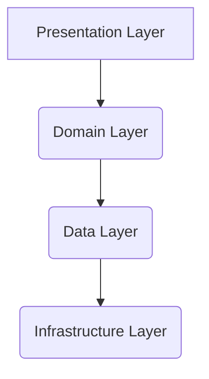
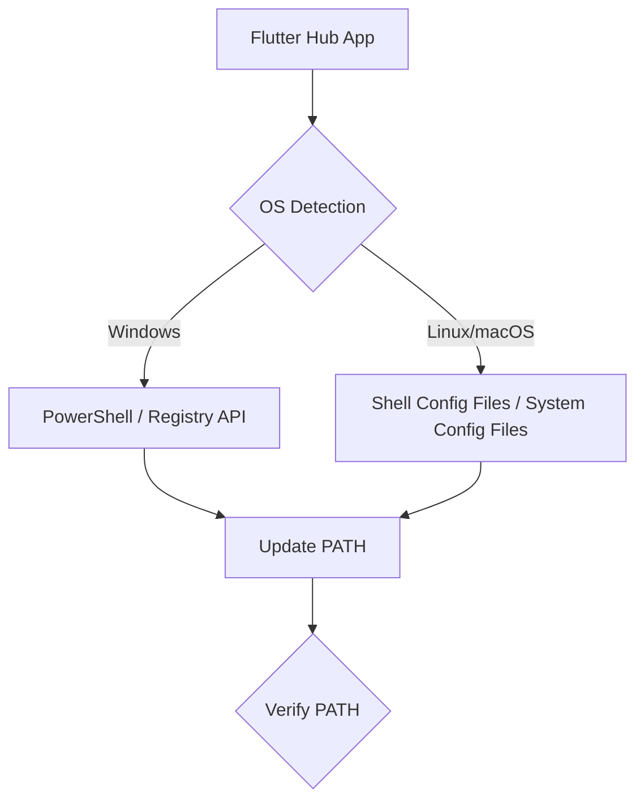
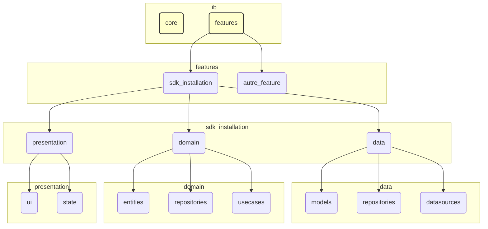

# Document de Conception : Flutter Hub

## 1. Vue d'ensemble

Le projet "Flutter Hub" vise à simplifier l'installation et la gestion de l'environnement de développement Flutter pour les utilisateurs sur différentes plateformes (Windows, Linux, macOS). Inspiré par des outils comme Unity Hub, il offrira une interface conviviale (GUI) et une option en ligne de commande (CLI) pour automatiser les tâches répétitives et souvent complexes liées à la mise en place de Flutter. L'objectif principal de cette première phase est de garantir une logique d'installation fiable et robuste du SDK Flutter, avant de se concentrer sur une interface utilisateur riche.

## 2. Analyse Détaillée de l'Objectif ou du Problème

L'installation de Flutter peut être un processus fastidieux, impliquant plusieurs étapes manuelles :
1.  **Téléchargement du SDK :** Trouver la bonne version sur le site officiel, choisir l'archive appropriée à l'OS.
2.  **Extraction :** Décompresser l'archive dans un emplacement désiré.
3.  **Configuration du PATH :** Ajouter le chemin du répertoire `bin` de Flutter à la variable d'environnement système PATH, ce qui varie considérablement entre les systèmes d'exploitation et peut être source d'erreurs pour les débutants.
4.  **Exécution de `flutter doctor` :** Lancer l'outil de diagnostic de Flutter et interpréter ses résultats, puis appliquer les corrections suggérées (installation de dépendances, configuration d'IDE, etc.).

Le "Flutter Hub" résoudra ces problèmes en :
*   **Automatisant le téléchargement :** Récupération de la dernière version stable du SDK Flutter depuis l'URL officielle.
*   **Simplifiant l'extraction :** Décompression automatique dans un dossier prédéfini ou choisi par l'utilisateur.
*   **Gérant le PATH :** Mise à jour automatique de la variable d'environnement PATH pour l'utilisateur actuel sur Windows, Linux et macOS. C'est le défi technique le plus important, car cela nécessite des interactions spécifiques au système d'exploitation et potentiellement des privilèges élevés.
*   **Guidant l'utilisateur :** Exécution de `flutter doctor` et présentation des résultats de manière compréhensible, avec des suggestions de corrections.
*   **Offrant une modularité :** La conception permettra d'ajouter facilement de futures fonctionnalités, comme l'intégration avec Android Studio, la gestion de multiples versions de Flutter, ou la création de projets.

## 3. Alternatives Considérées

*   **Installation Manuelle :** L'approche actuelle, sujette aux erreurs et chronophage. Le Flutter Hub vise à la remplacer.
*   **Scripts Shell/Batch :** Il serait possible de créer des scripts spécifiques à chaque OS pour automatiser l'installation. Cependant, cette approche manque d'une interface utilisateur unifiée, est difficile à maintenir et à distribuer, et ne permet pas une gestion d'état complexe ou une extensibilité facile. Le Flutter Hub offre une solution plus intégrée et maintenable.
*   **Utilisation d'outils de gestion de versions (ex: `fvm`) :** Des outils comme `fvm` (Flutter Version Management) existent pour gérer plusieurs versions de Flutter. Le Flutter Hub ne vise pas à remplacer `fvm` mais à simplifier l'installation initiale de *la première* version de Flutter, et pourrait potentiellement s'intégrer ou coexister avec `fvm` à l'avenir.

## 4. Conception Détaillée du Nouveau Paquet

### 4.1 Architecture

Nous adopterons une architecture "Clean Architecture" pour garantir la séparation des préoccupations, la testabilité et la maintenabilité. La structure du projet suivra une approche **"feature-first"**. Cela signifie que le code sera organisé par fonctionnalités (par exemple, `sdk_installation`, `project_management`) plutôt que par couches. Chaque dossier de fonctionnalité contiendra ses propres sous-dossiers pour les couches de l'architecture :

*   **Présentation (Presentation Layer) :** Contient l'interface utilisateur (GUI et CLI) et les ViewModels/Controllers. Utilise Riverpod pour la gestion de l'état et l'injection de dépendances.
*   **Domaine (Domain Layer) :** Contient la logique métier pure, les entités, les cas d'utilisation (use cases) et les interfaces des dépôts (repositories). C'est le cœur de l'application, indépendant de toute technologie spécifique.
*   **Données (Data Layer) :** Contient les implémentations des dépôts définis dans le domaine, ainsi que les sources de données (API, système de fichiers, préférences locales). Gère l'interaction avec le monde extérieur.
*   **Infrastructure (Infrastructure Layer) :** Gère les interactions spécifiques à la plateforme (par exemple, appels système, modification du PATH). Cette couche sera cruciale pour l'aspect multiplateforme et contiendra des implémentations spécifiques à chaque OS.

En plus des dossiers de fonctionnalités, un dossier `core` ou `shared` à la racine de `lib` contiendra le code partagé entre les différentes fonctionnalités (par exemple, les composants d'interface utilisateur, les utilitaires, la configuration du logger).



### 4.2 Gestion d'État (Riverpod)

Riverpod sera utilisé pour la gestion de l'état à travers l'application. Il offre une approche sûre et flexible pour l'injection de dépendances et la gestion de l'état, en évitant les problèmes de `Provider` traditionnels.

*   **Providers :** Seront utilisés pour exposer les dépendances (par exemple, les implémentations de dépôts) et l'état de l'application (par exemple, l'état de l'installation, la progression du téléchargement).
*   **`ConsumerWidget` / `ConsumerStatefulWidget` :** Pour reconstruire l'UI de manière réactive aux changements d'état.
*   **`Notifier` / `AsyncNotifier` :** Pour gérer la logique d'état complexe et les opérations asynchrones.

### 4.3 Journalisation (Logging)

Le package `logger` sera utilisé pour une journalisation complète et évolutive.

*   **Configuration :** Le logger sera configuré pour différents niveaux de journalisation (DEBUG, INFO, WARNING, ERROR, FATAL) et pourra être adapté pour écrire dans la console, des fichiers, ou même des services de surveillance.
*   **Contexte :** Les messages de journalisation incluront des informations contextuelles (par exemple, le nom de la classe/fonction, l'ID de la tâche) pour faciliter le débogage et le suivi.
*   **Gestion des erreurs :** Les erreurs et exceptions seront systématiquement journalisées avec les traces de pile complètes.

### 4.4 Fonctionnalités Principales : Installation du SDK Flutter

#### 4.4.1 Téléchargement du SDK

*   **Source :** L'URL officielle de téléchargement du SDK Flutter sera utilisée. Une vérification de la version la plus récente sera effectuée.
*   **Package :** Le package `dio` sera utilisé pour gérer le téléchargement du fichier ZIP du SDK. `dio` offre des fonctionnalités robustes comme la gestion de la progression, les annulations et les intercepteurs.
*   **Emplacement :** Le fichier sera téléchargé dans un répertoire temporaire (`getTemporaryDirectory()` de `path_provider`) avant d'être déplacé vers son emplacement final.

#### 4.4.2 Extraction du SDK

*   **Package :** Le package `flutter_archive` sera utilisé pour décompresser l'archive ZIP du SDK. Il est préféré à `archive` car il utilise les API natives pour une meilleure performance sur les plateformes supportées.
*   **Emplacement :** Le SDK sera extrait dans un répertoire choisi par l'utilisateur, par défaut un sous-répertoire de `getApplicationSupportDirectory()` ou `getApplicationDocumentsDirectory()` (par exemple, `~/.flutter_hub/sdk/`).

#### 4.4.3 Mise à jour de la variable d'environnement PATH

C'est la partie la plus complexe et la plus spécifique à l'OS.

*   **Problème :** Il n'existe pas de solution Dart/Flutter multiplateforme directe pour modifier la variable d'environnement PATH *système* de manière persistante et avec les permissions nécessaires.
*   **Approche :**
    *   **Windows :** Utilisation de commandes PowerShell ou d'appels à l'API Windows (via FFI) pour modifier les clés de registre `Environment` (pour l'utilisateur) ou `System\CurrentControlSet\Control\Session Manager\Environment` (pour le système, nécessite des privilèges administrateur).
    *   **Linux/macOS :** Modification des fichiers de configuration du shell de l'utilisateur (par exemple, `.bashrc`, `.zshrc`, `.profile`) ou des fichiers de configuration système (par exemple, `/etc/environment`, `/etc/profile`). Cela nécessite de savoir quel shell l'utilisateur utilise et d'avoir les permissions d'écriture.
*   **Permissions :** L'application devra demander des privilèges élevés (administrateur/sudo) pour effectuer ces modifications, surtout pour les modifications système.
*   **Validation :** Après modification, l'application vérifiera que le PATH a été correctement mis à jour en lançant une nouvelle instance de shell et en vérifiant la variable.



#### 4.4.4 Exécution de `flutter doctor`

*   **Exécution :** L'application exécutera la commande `flutter doctor` en tant que processus externe (`dart:io`).
*   **Analyse des résultats :** La sortie de `flutter doctor` sera capturée et analysée pour identifier les problèmes et les dépendances manquantes.
*   **Suggestions :** L'application présentera les problèmes de manière conviviale et proposera des actions pour les résoudre (par exemple, "Installer Android Studio", "Accepter les licences Android").

### 4.5 Interface Utilisateur (CLI & GUI)

*   **CLI :** Une interface en ligne de commande sera développée en utilisant le package `args` pour analyser les arguments. Elle permettra une installation sans tête et l'automatisation.
*   **GUI :** Une interface graphique simple sera construite avec Flutter, se concentrant initialement sur l'affichage de la progression de l'installation et des résultats de `flutter doctor`. L'accent sera mis sur la clarté et la facilité d'utilisation.

### 4.6 Modularité et Extensibilité

La Clean Architecture et l'utilisation de Riverpod faciliteront l'ajout de nouvelles fonctionnalités :
*   Gestion de plusieurs versions de Flutter.
*   Création et gestion de projets Flutter.
*   Intégration avec d'autres outils (par exemple, Android Studio, VS Code).

## 5. Diagrammes

### Diagramme des Couches (Conceptuel)

```mermaid
graph TD
    subgraph Presentation Layer
        A[GUI]
        B[CLI]
    end

    subgraph Domain Layer
        C[Use Cases]
        D[Entities]
        E[Repository Interfaces]
    end

    subgraph Data Layer
        F[SDK Repository Impl]
        G[System Config Repository Impl]
        H[File System Service]
    end

    subgraph Infrastructure Layer
        I[OS-Specific PATH Modifier]
        J[Process Executor]
        K[HTTP Client (Dio)]
        L[Archive Extractor (flutter_archive)]
    end

    A --> C
    B --> C
    C --> E
    F --> E
    G --> E
    H --> E
    F --> K
    F --> L
    G --> I
    G --> J
    H --> J
    H --> L

    style A fill:#f9f,stroke:#333,stroke-width:2px
    style B fill:#f9f,stroke:#333,stroke-width:2px
    style C fill:#ccf,stroke:#333,stroke-width:2px
    style D fill:#ccf,stroke:#333,stroke-width:2px
    style E fill:#ccf,stroke:#333,stroke-width:2px
    style F fill:#cfc,stroke:#333,stroke-width:2px
    style G fill:#cfc,stroke:#333,stroke-width:2px
    style H fill:#cfc,stroke:#333,stroke-width:2px
    style I fill:#ffc,stroke:#333,stroke-width:2px
    style J fill:#ffc,stroke:#333,stroke-width:2px
    style K fill:#ffc,stroke:#333,stroke-width:2px
    style L fill:#ffc,stroke:#333,stroke-width:2px
```

### Diagramme de la Structure des Dossiers (Feature-First)



## 6. Résumé

Le Flutter Hub sera une application multiplateforme robuste, construite sur une Clean Architecture avec Riverpod et une journalisation complète. Sa fonctionnalité principale sera l'installation automatisée du SDK Flutter, y compris le téléchargement, l'extraction et la configuration de la variable d'environnement PATH. La modification du PATH représente le défi technique le plus important et nécessitera des implémentations spécifiques à chaque système d'exploitation, potentiellement avec des privilèges élevés. L'application offrira à la fois une interface CLI et GUI, et sera conçue pour être modulaire et extensible.

## 7. Références

*   `dio` package: Pour le téléchargement de fichiers.
*   `flutter_archive` package: Pour l'extraction d'archives ZIP.
*   `path_provider` package: Pour la gestion des chemins de fichiers multiplateformes.
*   `dart:io`: Pour les opérations de système de fichiers et l'exécution de processus.
*   `logger` package: Pour la journalisation.
*   `riverpod` package: Pour la gestion d'état et l'injection de dépendances.
*   `args` package: Pour l'analyse des arguments CLI.
*   Documentation Flutter officielle pour l'installation.
*   Articles et discussions sur la modification du PATH système sur Windows, Linux et macOS via des programmes.
