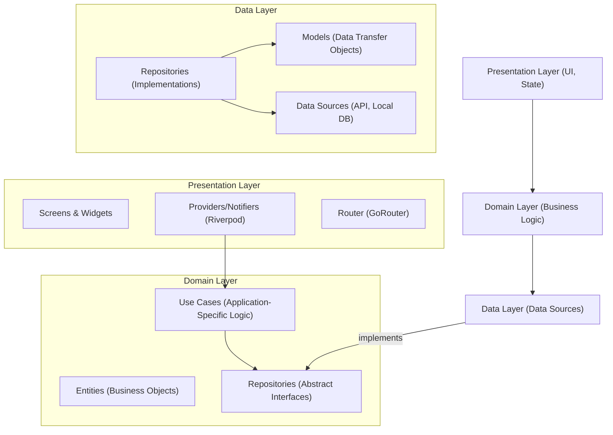

# Modification Design: Refactor to Feature-First Architecture with GoRouter and Riverpod

## 1. Overview

This document outlines the plan to refactor the existing Flutter application to a more robust and scalable architecture. The new architecture will be based on the "feature-first" principle, using `go_router` for navigation and `riverpod` for state management.

## 2. Analysis of the Goal or Problem

The current architecture, while functional, has several drawbacks:

*   **Lack of clear separation of concerns:** The current structure mixes UI, business logic, and data fetching, making it difficult to maintain and test.
*   **Scalability issues:** As the application grows, the current architecture will become increasingly complex and difficult to manage.
*   **Redundancy:** There is likely code duplication that can be eliminated with a more modular approach.
*   **Navigation:** The current navigation is not "clean" and is likely tightly coupled to the UI.

The goal is to address these issues by implementing a clean, feature-first architecture that is:

*   **Scalable:** Easy to add new features without affecting existing ones.
*   **Maintainable:** Code is organized logically and is easy to understand and modify.
*   **Testable:** Features and components can be tested in isolation.
*   **Robust:** Clear separation of concerns reduces the likelihood of bugs.

## 3. Alternatives Considered

We could have chosen other state management solutions like `bloc` or `provider`, or other routing packages like `auto_route`. However, `riverpod` and `go_router` were chosen for the following reasons:

*   **Riverpod:**
    *   Compile-safe and declarative.
    *   Provides a simple way to manage dependencies.
    *   Offers a variety of providers for different use cases.
    *   Is not dependent on the widget tree.
*   **GoRouter:**
    *   Declarative, URL-based routing.
    *   Excellent support for deep linking.
    *   Easy to handle complex navigation scenarios like authentication redirects.

## 4. Detailed Design

The refactoring will be done in several phases.

### 4.1. Project Structure

We will adopt a feature-first project structure. The `lib` directory will be organized as follows:

```
lib/
├── main.dart
├── core/                 # Application-wide utilities, base classes, themes, common widgets
│   ├── config/
│   ├── constants/
│   ├── navigation/         # GoRouter configuration
│   ├── theme/
│   └── widgets/
├── features/
│   ├── auth/             # Example feature
│   │   ├── data/
│   │   │   ├── models/
│   │   │   ├── repositories/
│   │   │   └── datasources/
│   │   ├── domain/
│   │   │   ├── entities/
│   │   │   ├── usecases/
│   │   │   └── repositories/ # Abstractions
│   │   └── presentation/
│   │       ├── providers/    # Riverpod providers for this feature
│   │       ├── screens/
│   │       ├── widgets/
│   │       └── auth_routes.dart # GoRouter routes for this feature
│   └── ...               # Other features
└── shared/
    ├── extensions/
    ├── services/
    └── widgets/
```

### 4.2. Dependency Injection and State Management with Riverpod

We will use `riverpod` for both dependency injection and state management.

*   **Providers:** Each feature will have its own set of providers, located in the `presentation/providers` directory.
*   **StateNotifiers/Notifiers:** For complex state, we will use `StateNotifier` or `Notifier` classes to encapsulate the business logic.
*   **Global Services:** Services that are used across multiple features (e.g., `AuthService`) will be provided at the root of the application.

### 4.3. Navigation with GoRouter

We will use `go_router` for all navigation.

*   **Feature-based routes:** Each feature will define its own routes in a dedicated file (e.g., `auth_routes.dart`).
*   **Centralized router:** The main `GoRouter` instance will be created in the `core/navigation` directory, and it will aggregate the routes from all features.
*   **Authentication:** We will use `go_router`'s `redirect` functionality to handle authentication.

### 4.4. Refactoring Plan

The refactoring will be done feature by feature. For each feature, we will:

1.  **Create the feature directory structure.**
2.  **Move the existing UI code** to the `presentation/screens` and `presentation/widgets` directories.
3.  **Create Riverpod providers** for the feature's state and business logic.
4.  **Refactor the UI code** to use the new providers.
5.  **Create GoRouter routes** for the feature's screens.
6.  **Remove the old navigation logic.**

### 4.5. Diagrams

#### High-Level Architecture



## 5. Summary of the Design

The proposed design will transform the application into a modern, scalable, and maintainable Flutter project. By leveraging a feature-first architecture, `go_router`, and `riverpod`, we will establish a solid foundation for future development.

## 6. References

*   [Flutter Project Structure - Code With Andrea](https://codewithandrea.com/articles/flutter-project-structure/)
*   [GoRouter Package](https://pub.dev/packages/go_router)
*   [Riverpod Documentation](https://riverpod.dev/)
